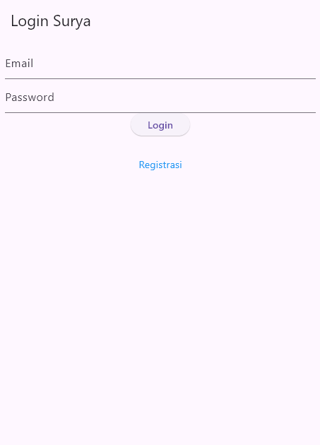
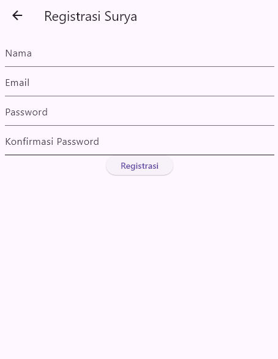
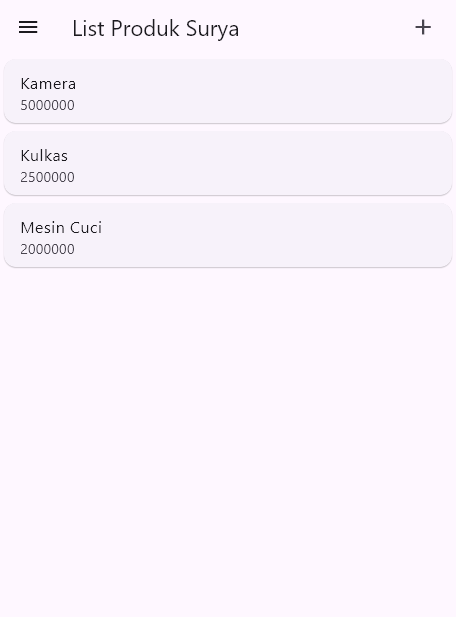
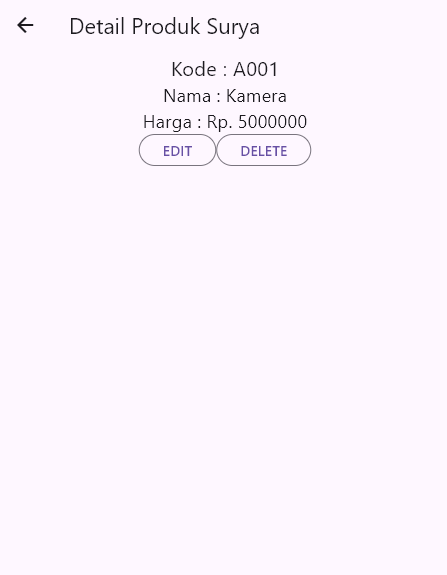
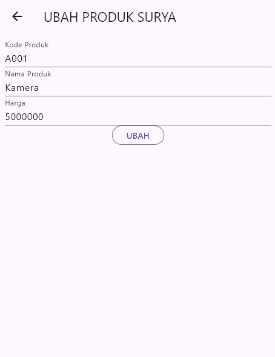
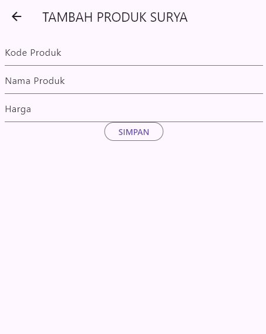

# TUGAS 8 - PERTEMUAN 10
# Identitas
Putranto Surya Wijanarko  
H1D023048  
Shift Awal & Baru : F  

# Penjelasan + SS
## Halaman Login
Halaman login menjadi default (halaman pertama) pada main.dart divalidasi berupa jangan kosong saja karena belum terhubung dengan REST API, sehingga login hanya navigate ke produk list  

## Halaman Registrasi
Halaman registrasi validasi sama dengan yang di halaman login dengan alasan yang sama pula, tidak di route ke halaman produk  

## Halaman List
Halaman list terdapat drawer yang logout nya belum berfungsi karena belum memiliki shared_preferences sehingga dummy terlebih dahulu, sisanya berupa list dari produk dengan data dummy (hardcoded)  

## Detail Produk
Berisi detail hardcoded juga dengan alasan yang sama, namun memiliki edit dan delete yang menggunakan Dialog karena WarningDialog entah dari zaman atau framework mana. Jika melakukan edit maka navigasi ke produk_form dengan mode Edit Barang  

## Ubah Produk
produk_form namun dengan mode Edit Barang validasi minimum dan tidak diperhatikan terlalu banyak disini  

## Tambah Produk
produk_form namun dengan mode tambah barang, penambahan belum bisa karena CRUD belum diimplementasikan dengan alasan yang sama  

