# TUGAS/Pertemuan => 9/11
# Identitas
Putranto Surya Wijanarko  
H1D023048  
Shift Awal & Baru : F  

# Penjelasan + SS
## Proses Registrasi dan Login 
Fitur ini memungkinkan pengguna untuk:  
- Melakukan registrasi dengan validasi input seperti email, nama, dan password.
- Login menggunakan email dan password.
- Menampilkan pesan sukses atau gagal menggunakan dialog custom.
- Setelah login, token dan user ID disimpan menggunakan helper UserInfo.

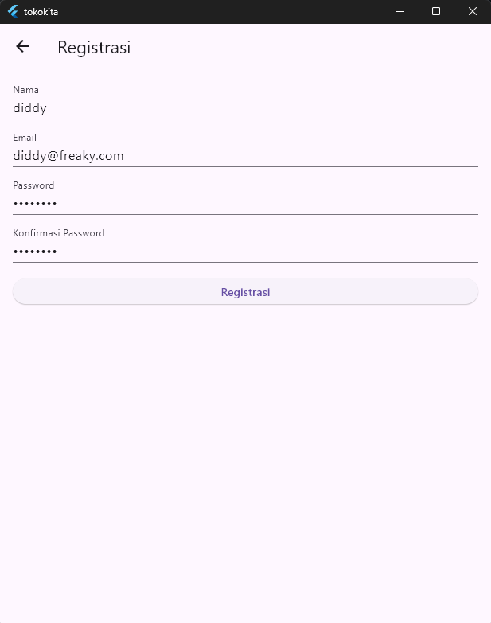 
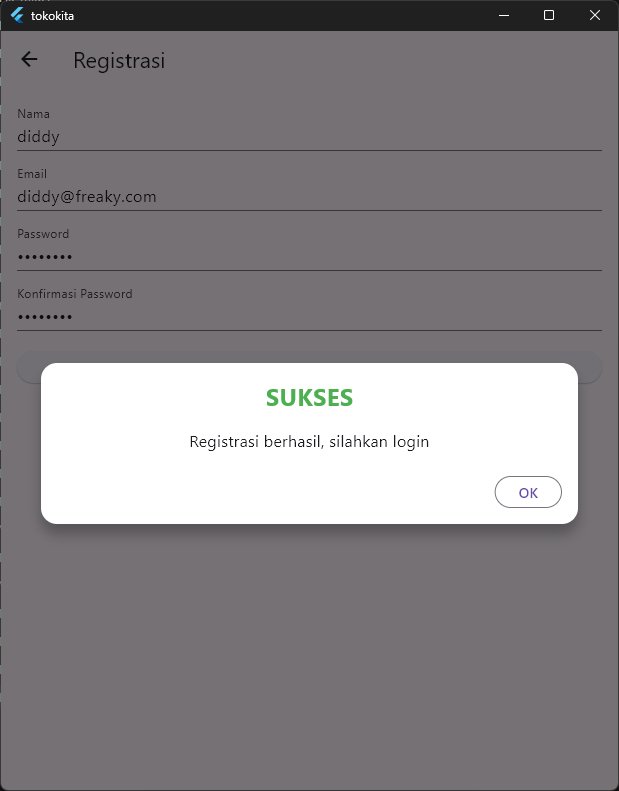   
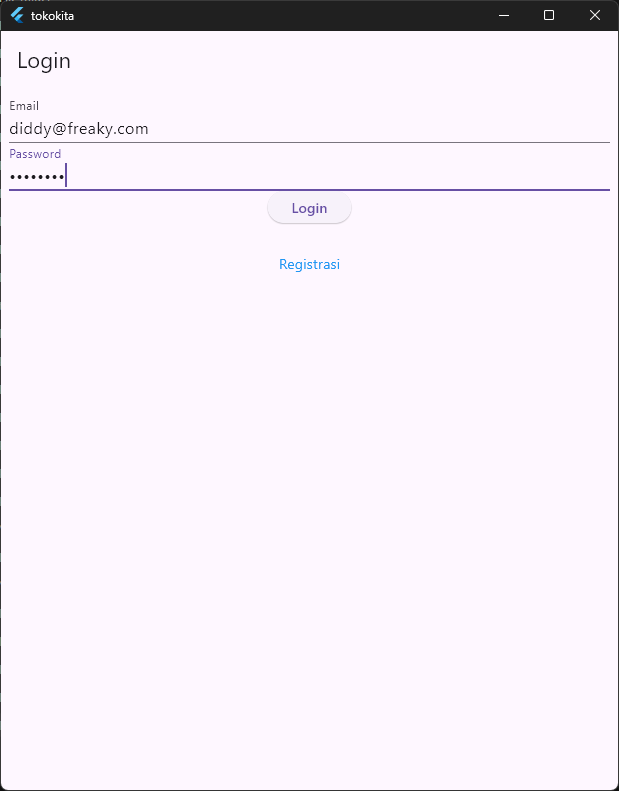  
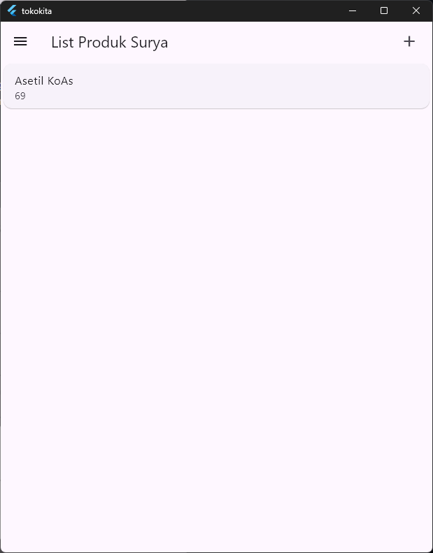  

Registrasi :  
```dart
import 'package:flutter/material.dart';
import 'package:tokokita/bloc/registrasi_bloc.dart';
import 'package:tokokita/widgets/success_dialog.dart';
import 'package:tokokita/widgets/warning_dialog.dart';

class RegistrasiPage extends StatefulWidget {
  const RegistrasiPage({super.key});

  @override
  // ignore: library_private_types_in_public_api
  _RegistrasiPageState createState() => _RegistrasiPageState();
}

class _RegistrasiPageState extends State<RegistrasiPage> {
  final _formKey = GlobalKey<FormState>();
  bool _isLoading = false;
  final _namaTextboxController = TextEditingController();
  final _emailTextboxController = TextEditingController();
  final _passwordTextboxController = TextEditingController();

  @override
  void dispose() {
    _namaTextboxController.dispose();
    _emailTextboxController.dispose();
    _passwordTextboxController.dispose();
    super.dispose();
  }

  @override
  Widget build(BuildContext context) {
    return Scaffold(
      appBar: AppBar(title: const Text('Registrasi')),
      body: SingleChildScrollView(
        child: Padding(
          padding: const EdgeInsets.all(16.0),
          child: Form(
            key: _formKey,
            child: Column(
              crossAxisAlignment: CrossAxisAlignment.stretch,
              children: [
                _namaTextField(),
                const SizedBox(height: 12),
                _emailTextField(),
                const SizedBox(height: 12),
                _passwordTextField(),
                const SizedBox(height: 12),
                _passwordKonfirmasiTextField(),
                const SizedBox(height: 20),
                _buttonRegistrasi(),
              ],
            ),
          ),
        ),
      ),
    );
  }

  // Membuat Textbox Nama
  Widget _namaTextField() {
    return TextFormField(
      decoration: const InputDecoration(labelText: 'Nama'),
      keyboardType: TextInputType.text,
      controller: _namaTextboxController,
      validator: (value) {
        if (value == null || value.trim().length < 3) {
          return 'Nama harus diisi minimal 3 karakter';
        }
        return null;
      },
    );
  }

  // Membuat Textbox email
  Widget _emailTextField() {
    return TextFormField(
      decoration: const InputDecoration(labelText: 'Email'),
      keyboardType: TextInputType.emailAddress,
      controller: _emailTextboxController,
      validator: (value) {
        if (value == null || value.trim().isEmpty) {
          return 'Email harus diisi';
        }
        // simple email validation
        final email = value.trim();
        final regex = RegExp(r"^[\w-\.]+@([\w-]+\.)+[\w-]{2,4}");
        if (!regex.hasMatch(email)) {
          return 'Email tidak valid';
        }
        return null;
      },
    );
  }

  // Membuat Textbox password
  Widget _passwordTextField() {
    return TextFormField(
      decoration: const InputDecoration(labelText: 'Password'),
      keyboardType: TextInputType.text,
      obscureText: true,
      controller: _passwordTextboxController,
      validator: (value) {
        if (value == null || value.length < 6) {
          return 'Password harus diisi minimal 6 karakter';
        }
        return null;
      },
    );
  }

  // membuat textbox Konfirmasi Password
  Widget _passwordKonfirmasiTextField() {
    return TextFormField(
      decoration: const InputDecoration(labelText: 'Konfirmasi Password'),
      keyboardType: TextInputType.text,
      obscureText: true,
      validator: (value) {
        if (value == null || value != _passwordTextboxController.text) {
          return 'Konfirmasi Password tidak sama';
        }
        return null;
      },
    );
  }

  //Membuat Tombol Registrasi
  Widget _buttonRegistrasi() {
    return ElevatedButton(
      child: const Text("Registrasi"),
      onPressed: () {
        var validate = _formKey.currentState!.validate();
        if (validate) {
          if (!_isLoading) _submit();
        }
      },
    );
  }

  void _submit() {
    _formKey.currentState!.save();
    setState(() {
      _isLoading = true;
    });
    RegistrasiBloc.registrasi(
      nama: _namaTextboxController.text,
      email: _emailTextboxController.text,
      password: _passwordTextboxController.text,
    ).then(
      (value) {
        showDialog(
          context: context,
          barrierDismissible: false,
          builder: (BuildContext context) => SuccessDialog(
            description: "Registrasi berhasil, silahkan login",
            okClick: () {
              Navigator.pop(context);
            },
          ),
        );
      },
      onError: (error) {
        showDialog(
          context: context,
          barrierDismissible: false,
          builder: (BuildContext context) => const WarningDialog(
            description: "Registrasi gagal, silahkan coba lagi",
          ),
        );
      },
    );
  }
}

```

Login :  
```dart
import 'package:flutter/material.dart';
import 'package:tokokita/bloc/login_bloc.dart';
import 'package:tokokita/helpers/user_info.dart';
import 'package:tokokita/ui/produk_page.dart';
import 'package:tokokita/ui/registrasi_page.dart';
import 'package:tokokita/widgets/warning_dialog.dart';

class LoginPage extends StatefulWidget {
  const LoginPage({Key? key}) : super(key: key);

  @override
  _LoginPageState createState() => _LoginPageState();
}

class _LoginPageState extends State<LoginPage> {
  final _formKey = GlobalKey<FormState>();
  bool _isLoading = false;

  final _emailTextboxController = TextEditingController();
  final _passwordTextboxController = TextEditingController();

  @override
  Widget build(BuildContext context) {
    return Scaffold(
      appBar: AppBar(title: const Text('Login')),
      body: SingleChildScrollView(
        child: Padding(
          padding: const EdgeInsets.all(8.0),
          child: Form(
            key: _formKey,
            child: Column(
              children: [
                _emailTextField(),
                _passwordTextField(),
                _buttonLogin(),
                const SizedBox(height: 30),
                _menuRegistrasi(),
              ],
            ),
          ),
        ),
      ),
    );
  }

  //Membuat Textbox email
  Widget _emailTextField() {
    return TextFormField(
      decoration: const InputDecoration(labelText: "Email"),
      keyboardType: TextInputType.emailAddress,
      controller: _emailTextboxController,
      validator: (value) {
        if (value!.isEmpty) {
          return 'Email harus diisi';
        }
        return null;
      },
    );
  }

  //Membuat Textbox password
  Widget _passwordTextField() {
    return TextFormField(
      decoration: const InputDecoration(labelText: "Password"),
      keyboardType: TextInputType.text,
      obscureText: true,
      controller: _passwordTextboxController,
      validator: (value) {
        if (value!.isEmpty) {
          return "Password harus diisi";
        }
        return null;
      },
    );
  }

  //Membuat Tombol Login
  Widget _buttonLogin() {
    return ElevatedButton(
      child: const Text("Login"),
      onPressed: () {
        var validate = _formKey.currentState!.validate();
        if (validate) {
          if (!_isLoading) _submit();
        }
      },
    );
  }

  void _submit() {
    _formKey.currentState!.save();
    setState(() {
      _isLoading = true;
    });
    LoginBloc.login(
      email: _emailTextboxController.text,
      password: _passwordTextboxController.text,
    ).then(
      (value) async {
        if (value.code == 200) {
          print(value.userId);
          print(value.token);

          await UserInfo().setToken(value.token.toString());
          if (value.userId != null) {
            await UserInfo().setUserID(int.parse(value.userId.toString()));
          }

          Navigator.pushReplacement(
            context,
            MaterialPageRoute(builder: (context) => const ProdukPage()),
          );
        } else {
          showDialog(
            context: context,
            barrierDismissible: false,
            builder: (BuildContext context) => const WarningDialog(
              description: "Login gagal, silahkan coba lagi",
            ),
          );
        }
      },
      onError: (error) {
        print(error);
        showDialog(
          context: context,
          barrierDismissible: false,
          builder: (BuildContext context) => const WarningDialog(
            description: "Login gagal, silahkan coba lagi",
          ),
        );
      },
    );
    setState(() {
      _isLoading = false;
    });
  }

  // Membuat menu untuk membuka halaman registrasi
  Widget _menuRegistrasi() {
    return Center(
      child: InkWell(
        child: const Text("Registrasi", style: TextStyle(color: Colors.blue)),
        onTap: () {
          Navigator.push(
            context,
            MaterialPageRoute(builder: (context) => const RegistrasiPage()),
          );
        },
      ),
    );
  }
}
```

## Detail, Ubah dan Delete
Fitur Produk:
- Menampilkan daftar produk menggunakan FutureBuilder.
- Klik salah satu item membuka halaman detail.
- Dapat Tambah, Edit, dan Hapus produk melalui ProdukForm.
- Data produk diambil dari API menggunakan ProdukBloc.

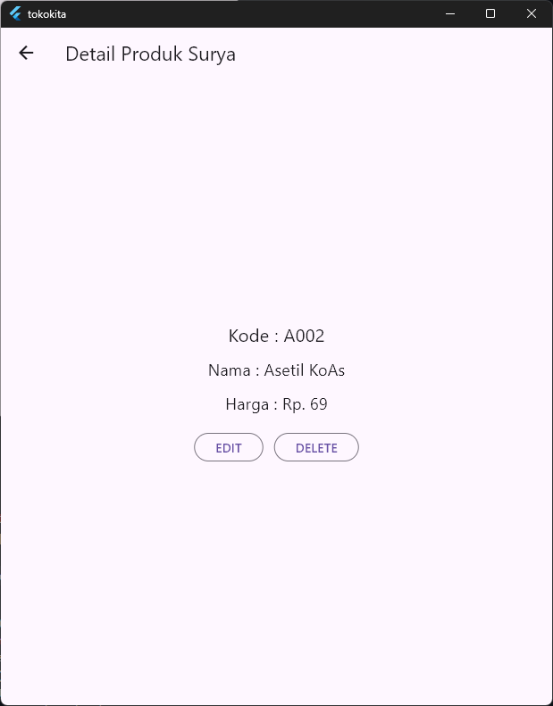
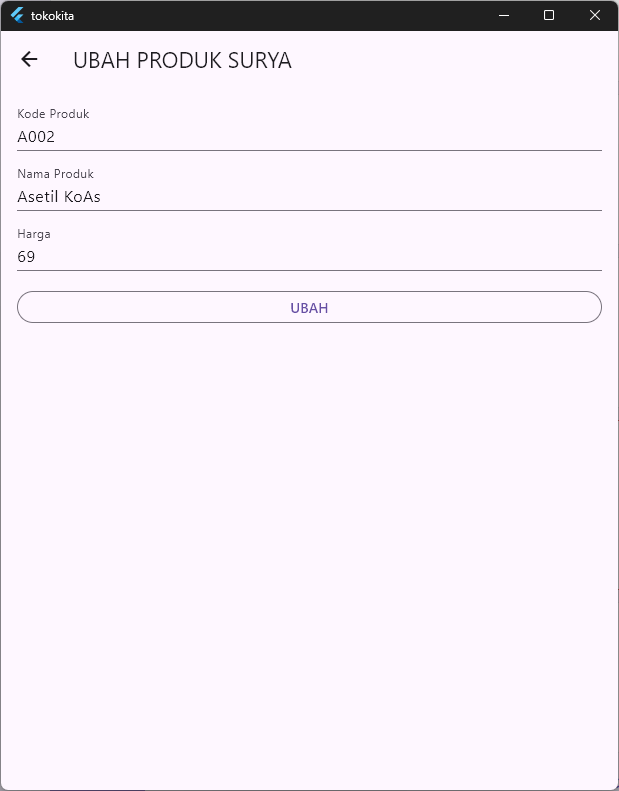
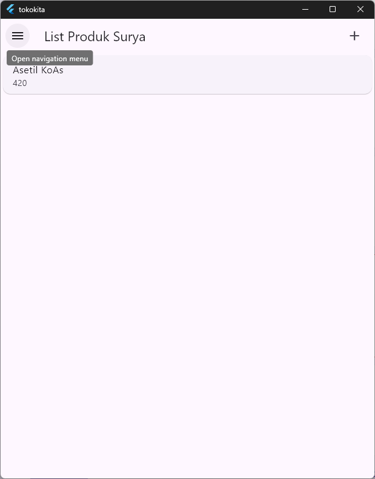
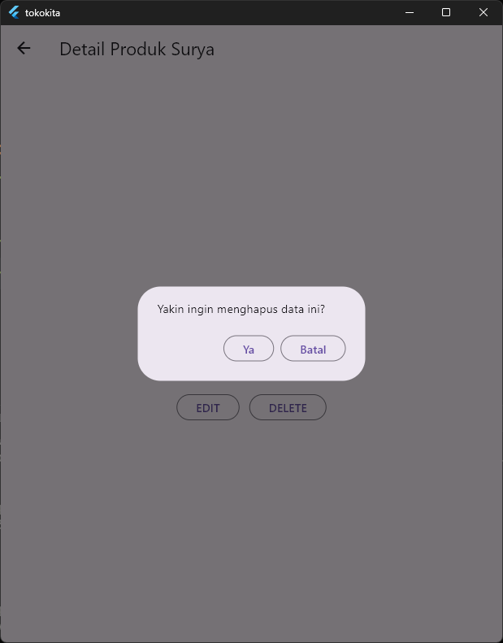
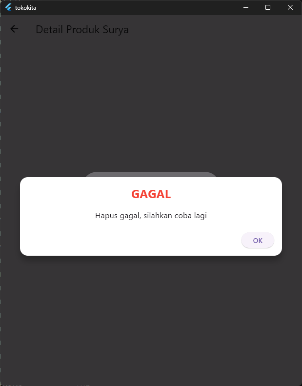

Produke Page : 

```dart
import 'package:flutter/material.dart';
import 'package:tokokita/bloc/logout_bloc.dart';
import 'package:tokokita/model/produk.dart';
import 'package:tokokita/ui/login_page.dart';
import 'package:tokokita/ui/produk_detail.dart';
import 'package:tokokita/ui/produk_form.dart';
import 'package:tokokita/bloc/produk_bloc.dart';

class ProdukPage extends StatefulWidget {
  const ProdukPage({Key? key}) : super(key: key);
  @override
  _ProdukPageState createState() => _ProdukPageState();
}

class _ProdukPageState extends State<ProdukPage> {
  @override
  Widget build(BuildContext context) {
    return Scaffold(
      appBar: AppBar(
        title: const Text('List Produk Surya'),
        actions: [
          Padding(
            padding: const EdgeInsets.only(right: 20.0),
            child: GestureDetector(
              child: const Icon(Icons.add, size: 26.0),
              onTap: () async {
                Navigator.push(
                  context,
                  MaterialPageRoute(builder: (context) => ProdukForm()),
                );
              },
            ),
          ),
        ],
      ),
      drawer: Drawer(
        child: ListView(
          children: [
            ListTile(
              title: const Text('Logout'),
              trailing: const Icon(Icons.logout),
              onTap: () async {
                await LogoutBloc.logout().then(
                  (value) => {
                    Navigator.of(context).pushAndRemoveUntil(
                      MaterialPageRoute(builder: (context) => LoginPage()),
                      (route) => false,
                    ),
                  },
                );
              },
            ),
          ],
        ),
      ),
      body: FutureBuilder<List>(
        future: ProdukBloc.getProduks(),
        builder: (context, snapshot) {
          if (snapshot.hasError) print(snapshot.error);
          return snapshot.hasData
              ? ListProduk(list: snapshot.data)
              : const Center(child: CircularProgressIndicator());
        },
      ),
    );
  }
}

class ListProduk extends StatelessWidget {
  final List? list;
  const ListProduk({Key? key, this.list}) : super(key: key);
  @override
  Widget build(BuildContext context) {
    return ListView.builder(
      itemCount: list == null ? 0 : list!.length,
      itemBuilder: (context, i) {
        return ItemProduk(produk: list![i]);
      },
    );
  }
}

class ItemProduk extends StatelessWidget {
  final Produk produk;

  const ItemProduk({Key? key, required this.produk}) : super(key: key);

  @override
  Widget build(BuildContext context) {
    return GestureDetector(
      onTap: () {
        Navigator.push(
          context,
          MaterialPageRoute(builder: (context) => ProdukDetail(produk: produk)),
        );
      },
      child: Card(
        child: ListTile(
          title: Text(produk.namaProduk!),
          subtitle: Text(produk.hargaProduk.toString()),
        ),
      ),
    );
  }
}
```

## Tambah Produk
- Form digunakan untuk Tambah Produk dan Edit Produk.
- Saat update, field otomatis terisi.
- Submit akan memanggil API melalui ProdukBloc.

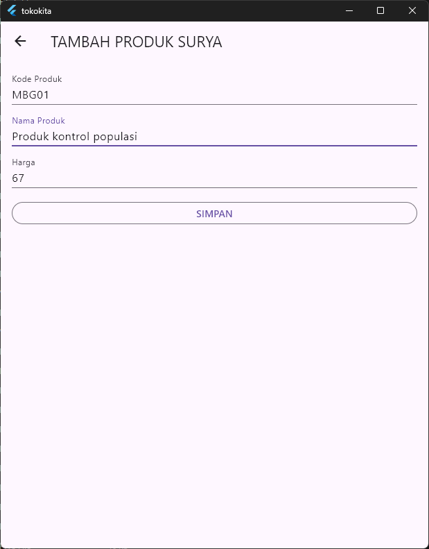
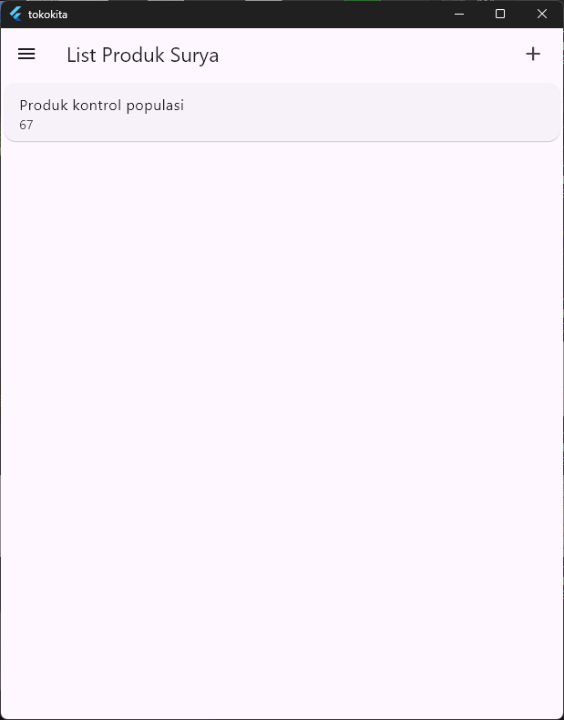

Produk Form : 

```dart
import 'package:flutter/material.dart';
import 'package:tokokita/model/produk.dart';
import 'package:tokokita/bloc/produk_bloc.dart';
import 'package:tokokita/ui/produk_page.dart';
import 'package:tokokita/widgets/warning_dialog.dart';

// ignore: must_be_immutable
class ProdukForm extends StatefulWidget {
  Produk? produk;

  ProdukForm({Key? key, this.produk}) : super(key: key);

  @override
  _ProdukFormState createState() => _ProdukFormState();
}

class _ProdukFormState extends State<ProdukForm> {
  final _formKey = GlobalKey<FormState>();
  bool _isLoading = false;
  String judul = "TAMBAH PRODUK | Surya";
  String tombolSubmit = "SIMPAN";
  final _kodeProdukTextboxController = TextEditingController();
  final _namaProdukTextboxController = TextEditingController();
  final _hargaProdukTextboxController = TextEditingController();

  @override
  void initState() {
    super.initState();
    isUpdate();
  }

  void isUpdate() {
    if (widget.produk != null) {
      setState(() {
        judul = "UBAH PRODUK SURYA";
        tombolSubmit = "UBAH";
        _kodeProdukTextboxController.text = widget.produk!.kodeProduk!;
        _namaProdukTextboxController.text = widget.produk!.namaProduk!;
        _hargaProdukTextboxController.text = widget.produk!.hargaProduk
            .toString();
      });
    } else {
      judul = "TAMBAH PRODUK SURYA";
      tombolSubmit = "SIMPAN";
    }
  }

  @override
  void dispose() {
    _kodeProdukTextboxController.dispose();
    _namaProdukTextboxController.dispose();
    _hargaProdukTextboxController.dispose();
    super.dispose();
  }

  @override
  Widget build(BuildContext context) {
    return Scaffold(
      appBar: AppBar(title: Text(judul)),
      body: SingleChildScrollView(
        child: Padding(
          padding: const EdgeInsets.all(16.0),
          child: Form(
            key: _formKey,
            child: Column(
              crossAxisAlignment: CrossAxisAlignment.stretch,
              children: [
                _kodeProdukTextField(),
                const SizedBox(height: 12),
                _namaProdukTextField(),
                const SizedBox(height: 12),
                _hargaProdukTextField(),
                const SizedBox(height: 20),
                _buttonSubmit(),
              ],
            ),
          ),
        ),
      ),
    );
  }

  // Membuat Textbox Kode Produk
  Widget _kodeProdukTextField() {
    return TextFormField(
      decoration: const InputDecoration(labelText: 'Kode Produk'),
      keyboardType: TextInputType.text,
      controller: _kodeProdukTextboxController,
      validator: (value) {
        if (value == null || value.trim().isEmpty) {
          return 'Kode Produk harus diisi';
        }
        return null;
      },
    );
  }

  // Membuat Textbox Nama Produk
  Widget _namaProdukTextField() {
    return TextFormField(
      decoration: const InputDecoration(labelText: 'Nama Produk'),
      keyboardType: TextInputType.text,
      controller: _namaProdukTextboxController,
      validator: (value) {
        if (value == null || value.trim().isEmpty) {
          return 'Nama Produk harus diisi';
        }
        return null;
      },
    );
  }

  // Membuat Textbox Harga Produk
  Widget _hargaProdukTextField() {
    return TextFormField(
      decoration: const InputDecoration(labelText: 'Harga'),
      keyboardType: TextInputType.number,
      controller: _hargaProdukTextboxController,
      validator: (value) {
        if (value == null || value.trim().isEmpty) {
          return 'Harga harus diisi';
        }
        return null;
      },
    );
  }

  Widget _buttonSubmit() {
    return OutlinedButton(
      child: Text(tombolSubmit),
      onPressed: () {
        var validate = _formKey.currentState!.validate();
        if (validate) {
          if (!_isLoading) {
            if (widget.produk != null) {
              ubah();
            } else {
              //kondisi tambah produk
              simpan();
            }
          }
        }
      },
    );
  }

  simpan() {
    setState(() {
      _isLoading = true;
    });
    Produk createProduk = Produk(id: null);
    createProduk.kodeProduk = _kodeProdukTextboxController.text;
    createProduk.namaProduk = _namaProdukTextboxController.text;
    createProduk.hargaProduk = int.parse(_hargaProdukTextboxController.text);
    ProdukBloc.addProduk(produk: createProduk).then(
      (value) {
        Navigator.of(context).push(
          MaterialPageRoute(
            builder: (BuildContext context) => const ProdukPage(),
          ),
        );
      },
      onError: (error) {
        showDialog(
          context: context,
          builder: (BuildContext context) => const WarningDialog(
            description: "Simpan gagal, silahkan coba lagi",
          ),
        );
      },
    );
    setState(() {
      _isLoading = false;
    });
  }

  ubah() {
    setState(() {
      _isLoading = true;
    });
    Produk updateProduk = Produk(id: widget.produk!.id!);
    updateProduk.kodeProduk = _kodeProdukTextboxController.text;
    updateProduk.namaProduk = _namaProdukTextboxController.text;
    updateProduk.hargaProduk = int.parse(_hargaProdukTextboxController.text);
    ProdukBloc.updateProduk(produk: updateProduk).then(
      (value) {
        Navigator.of(context).push(
          MaterialPageRoute(
            builder: (BuildContext context) => const ProdukPage(),
          ),
        );
      },
      onError: (error) {
        showDialog(
          context: context,
          builder: (BuildContext context) => const WarningDialog(
            description: "Permintaan ubah data gagal, silahkan coba lagi",
          ),
        );
      },
    );
    setState(() {
      _isLoading = false;
    });
  }
}

```

## Logout
Saat logout:
- Token dihapus melalui LogoutBloc.
- User diarahkan kembali ke halaman login menggunakan pushAndRemoveUntil.

Bagian dari Produk Page :

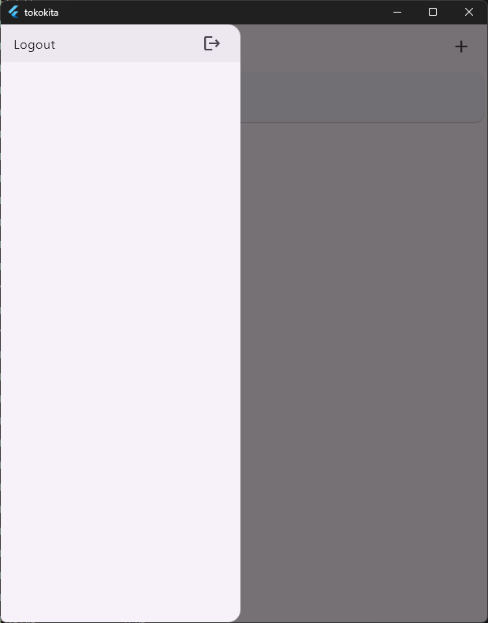
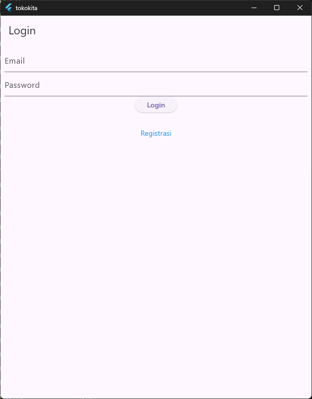
```dart
...
      drawer: Drawer(
        child: ListView(
          children: [
            ListTile(
              title: const Text('Logout'),
              trailing: const Icon(Icons.logout),
              onTap: () async {
                await LogoutBloc.logout().then(
                  (value) => {
                    Navigator.of(context).pushAndRemoveUntil(
                      MaterialPageRoute(builder: (context) => LoginPage()),
                      (route) => false,
                    ),
                  },
                );
              },
            ),
          ],
        ),
      ),
      body: FutureBuilder<List>(
        future: ProdukBloc.getProduks(),
        builder: (context, snapshot) {
          if (snapshot.hasError) print(snapshot.error);
          return snapshot.hasData
              ? ListProduk(list: snapshot.data)
              : const Center(child: CircularProgressIndicator());
        },
      ),
    );
  }
}
...
```
